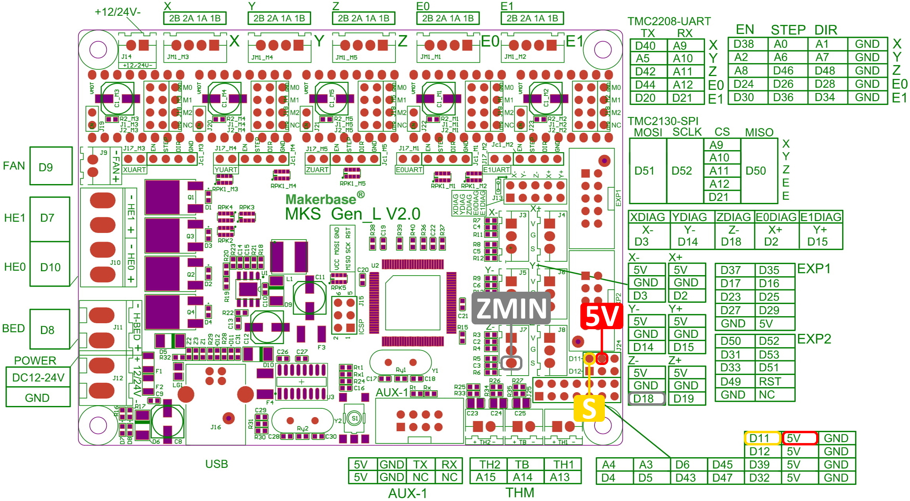
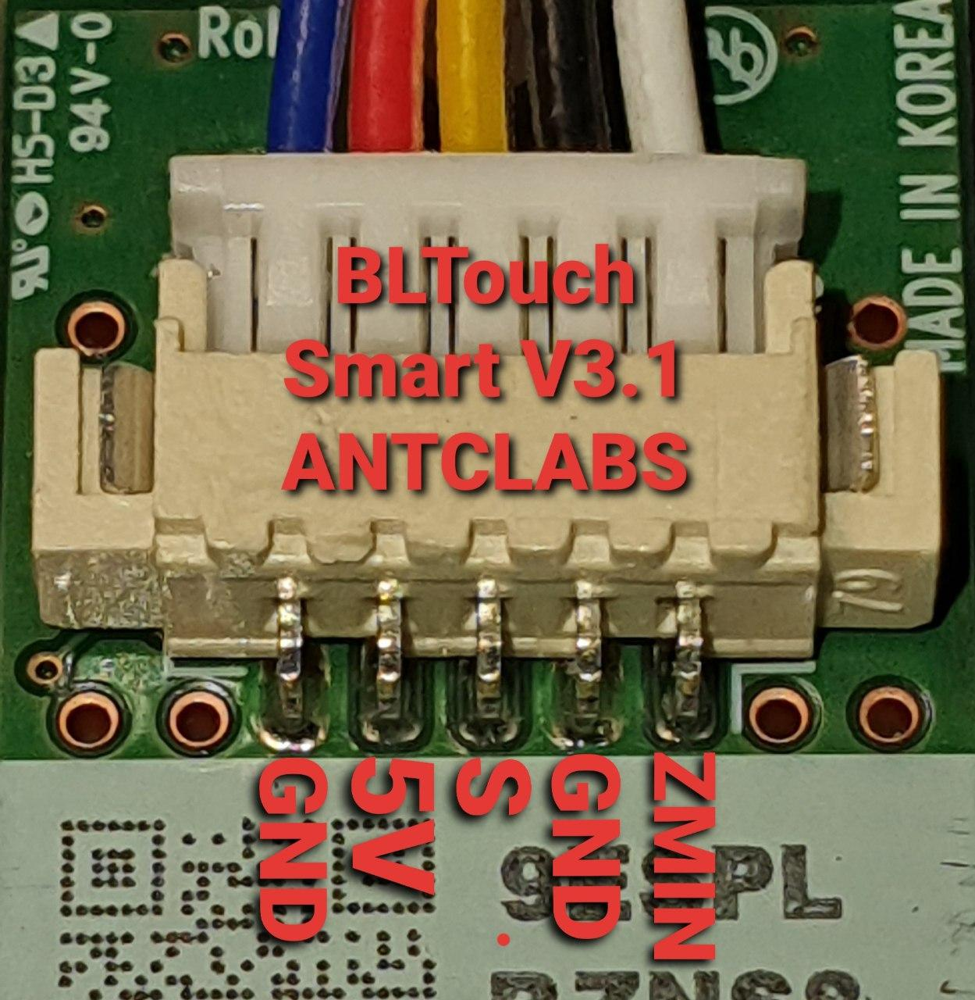

# Marlin 2.0.3 ZBolt Plus TMC2208(UART) BlTouch MKS 2.0
Configuration example for Marlin 2.0.3 for MKS Gen L 2.0 board with TMC2208(UART) drivers and BLTouch V2.0

# BLTouch V2.0 connection
Pins:  
BLTouch--Board  
  ZMIN -- D18  
     S -- D11  
    5V -- 5V  
*You can cutoff one of GND wires(blue one) on BLTouch, another GND wire is connected to ground on printing head.

